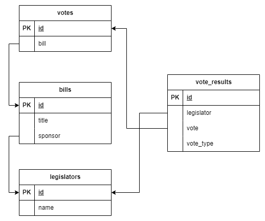

# QUORUM APP INTERVIEW

Application developed for interview testing for quorum.us with the aim of allowing the user to view
 data on Legislators, their votes and Bills.

 ## Data modeling

<p align="center">
    
</p>

## Prerequisites

- [Poetry](https://python-poetry.org/)
- [Python 3.12.x](https://www.python.org/downloads/release/python-3120/)

## Installation

The project was developed using [poetry](https://python-poetry.org/) package management, but can also be developed using [pip](https://pip.pypa.io/en/stable/).

### Poetry

After create a virtual environment, install the ependencies.

```bash
poetry install
```

### Pip

After create a virtual environment (ex. [venv](https://docs.python.org/3/library/venv.html)), install the ependencies.

```bash
pip install -r requirements.txt
```

## How to Use the Project

### 1. Create database

To do this, just run:

```bash
make migrate
```

### 2. Populate the database

Place the CSV files in the directory `/src/congress/csvfiles/`.

`WARNING`:
- It is essential that the file names begin with the following patterns: legislators, bills, votes
 and vote_results.
- There should only be four files in the `csvfiles/` directory

After that and run:

```bash
make populate
```

If there is any inconsistency in the data imported from the CSV file, error messages similar to
 these will appear.

```bash
[csv inconsistency] [bill id 2900994] Does not exist Legislator with sponsor_id: 400100
[csv inconsistency] [vote id 3314452] Does not exist Bill with bill_id: 29
[csv inconsistency] [vote id 3321166] Does not exist Bill with bill_id: 295
[csv inconsistency] [vote result id 92516784] Does not exist Vote with vote_id: 3321166
[csv inconsistency] [vote result id 92516770] Does not exist Vote with vote_id: 3321166
```

### 3. Start application

Run

```bash
make up
```

Acsess [http://127.0.0.1:8000/congress](http://127.0.0.1:8000/congress)

## How to run tests

Run

```bash
make test
```
